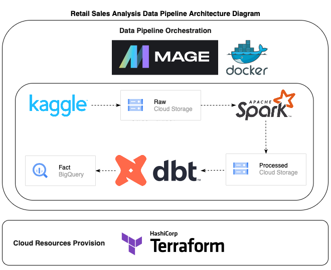
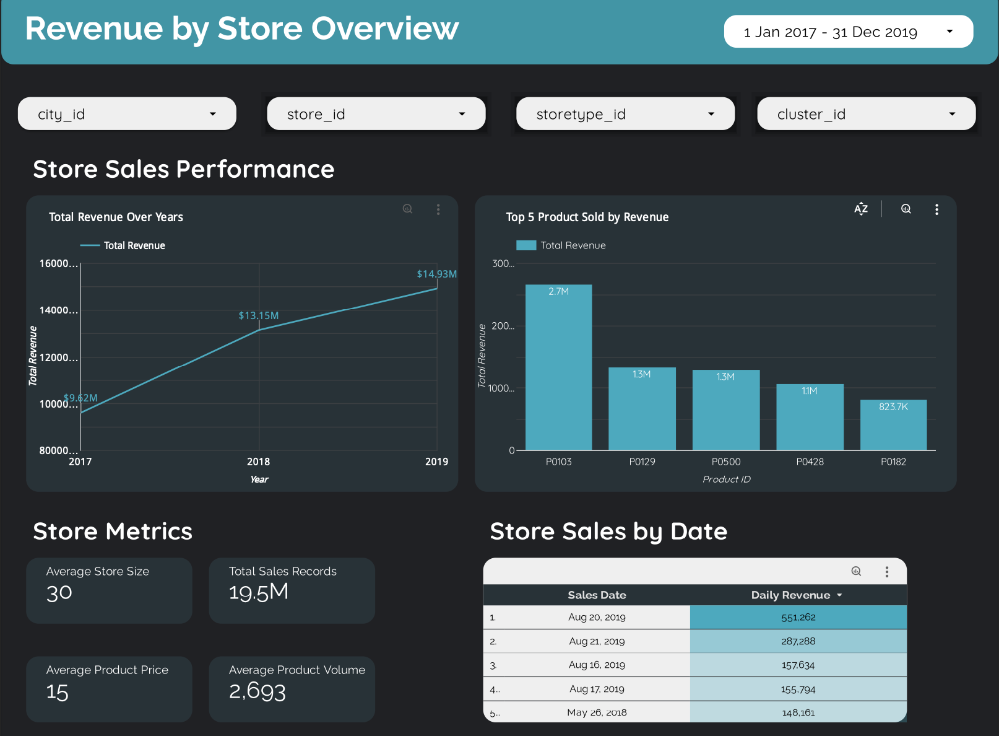

# Retail Sales Data Engineering Pipeline

This project automates a data engineering pipeline to analyze retail sales data and generate a comprehensive sales dashboard. This dashboard will empower us to visualize revenue generated by each store and identify the factors influencing those figures.

## Problem Statement

Gaining a clear understanding of store performance is crucial for effective retail management. However, manually analyzing vast sales data sets makes it difficult to:
- Compare revenue across stores: Quickly identify top-performing and underperforming locations.
- Uncover trends: Analyze factors impacting revenue, such as location, product mix, or marketing efforts.
- Make data-driven decisions: Effectively allocate resources and optimize strategies based on real-time insights.

## Solution

This pipeline automates data processing and prepares the data for analysis in Google BigQuery. This allows us to:
- Visualize store revenue: Create clear visualizations comparing revenue across all stores over time.
- Identify influencing factors: Analyze the impact of location, product categories, promotions, and other relevant factors on store performance.
- Gain actionable insights: Leverage the sales dashboard to pinpoint areas for improvement and make data-driven decisions to optimize store performance and maximize profitability.

## Project Details
This project proposes a data engineering pipeline that automates the data processing workflow utilizing the following tech stacks:
- [`Mage AI`](https://github.com/mage-ai/mage-ai) for data pipeline orchestration
- `Google Cloud Platform (GCP)` services for storage
- [`Pyspark`](https://github.com/apache/spark) for big data loading and transformation
- [`DBT`](https://github.com/dbt-labs/dbt-core) for data transformation 
- [`Terraform`](https://github.com/hashicorp/terraform) for cloud resources provision
- `Looker Studio` for dashboard

The pipeline will:

- Extract retail sales data from [Kaggle Retail Sales Data](https://www.kaggle.com/datasets/berkayalan/retail-sales-data/) which consists of sales data collected from a Turkish retail company. Time period begins from 2017 to the end of 2019.
- Validate the data against pre-defined schemas to ensure consistency and quality.
- Load the processed data into a BigQuery table.
- Transform the data to prepare it for analysis with DBT.

## Data Pipeline Architecture

Diagram below shows an overview of data pipeline architecture used in this project.
<br>

<p align="left">
    
    <em></em>
</p>

More info about data pipeline with Mage can be found here.

## Running the Project

### Prerequisites

Place the following JSON files to `secrets` folder. 
1. GCP Credentials API Key. Refer [here](https://cloud.google.com/docs/authentication/api-keys#create) for instructions. Ensure proper IAM role was given to the user.
2. Kaggle API Key. Refer [here](https://www.kaggle.com/docs/api) for instructions. 

### Makefile
This project utilizes a `Makefile` to automate various tasks. Here's how to use the Makefile to run the pipeline:

**1. Cloud resources provision:**
```script
make terraform
```
* Use the `make terraform` command to initialize Terraform in the terraform` directory. This make command will trigger a series of Terraform command to initialize Terraform in the Terraform directory, format Terraform code to ensure it adheres to a consistent style, preview the changes Terraform will make to your GCP resources based on your configuration and finally create or modify GCP resources as defined in your Terraform configuration.

**Remember:**

* Update the `terraform` directory with your GCP project ID and desired resource configurations before running these commands.

**2. Destroying Terraform resources:**
```script
make terraform_destroy
```
* Use `make terraform_destroy` to remove all resources provisioned by Terraform. This is useful for cleaning up your environment.

**3. Launching the Data Pipeline:**
```script
make docker
```
* Run `make docker` to start the data processing container defined in `docker-compose.yml`. This container executes the data pipeline steps using Mage AI.

**4. Stopping the Data Pipeline:**
```script
make docker_down
```
* Use `make docker_down` to stop the running data processing container.

**5. Getting Help:**
```script
Available rules:

docker              Launch data pipeline container
docker_down         Destroy data pipeline container
terraform           Create cloud resources via Terraform
terraform_destroy   Destroy cloud resources via Terraform
```
* Type `make` to display a list of available commands and their brief descriptions.

## Dashboard
<br>

<p align="left">
    
    <em></em>
</p>

The dashboard is available for viewing [here](https://lookerstudio.google.com/reporting/303e81af-f3c3-4c08-90f0-85bcb9cbce85).

## Resources

- [Data Engineering Zoomcamp by DataTalks.Club](https://github.com/DataTalksClub/data-engineering-zoomcamp)
