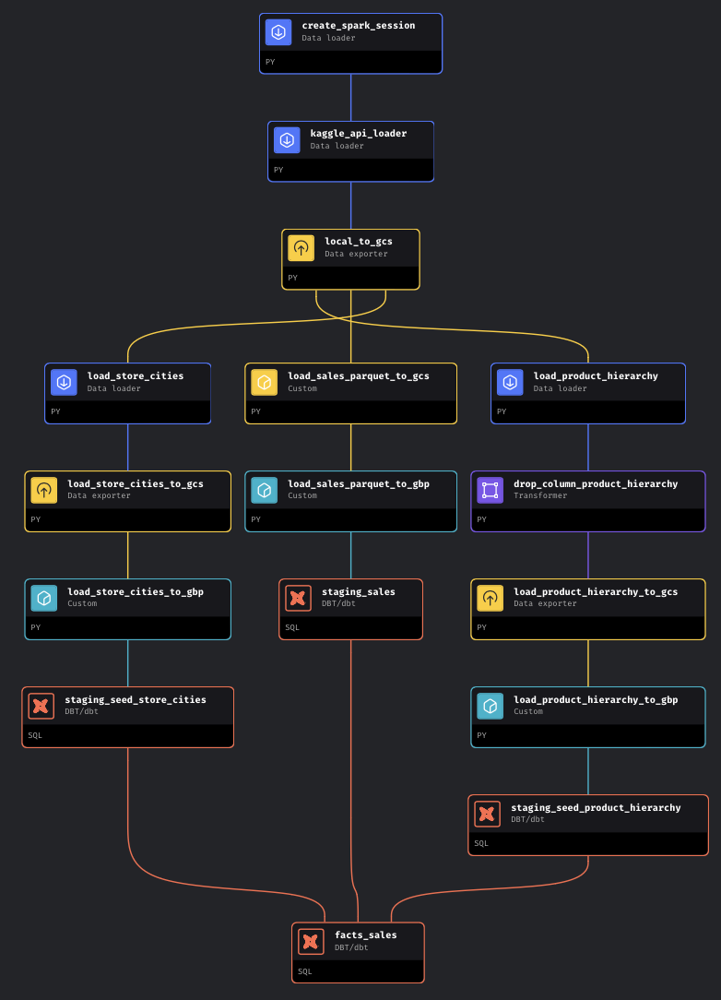
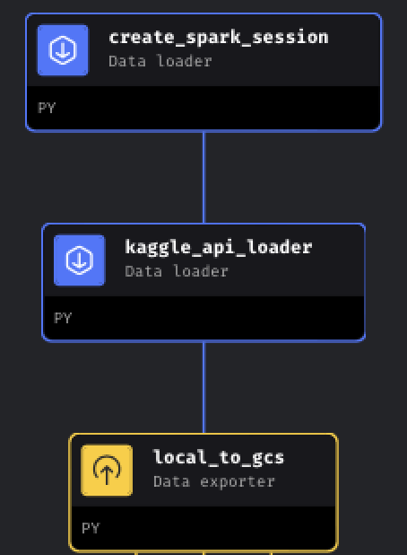
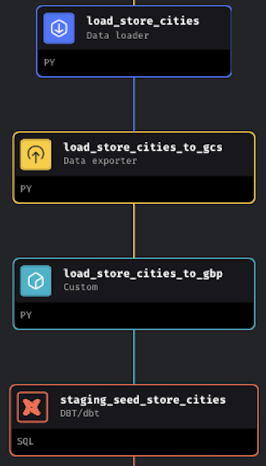
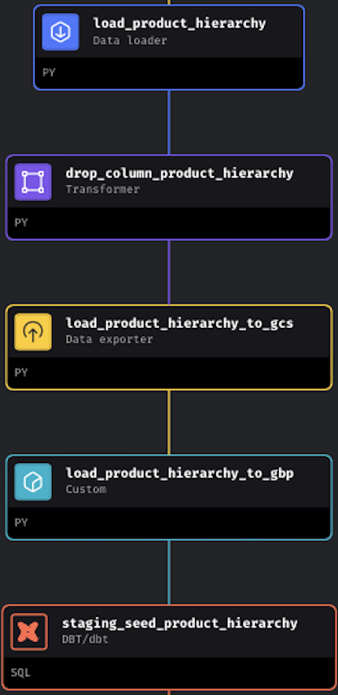
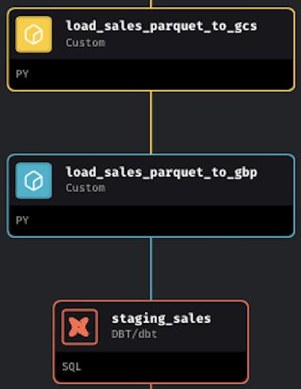
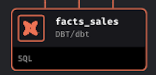

# Mage Data Engineering Pipeline

[Data Ingestion Pipeline](#data-ingestion-pipeline) •
[Cities Data Ingestion Pipeline](#cities-data-ingestion-pipeline) •
[Product Hierarchy Data Ingestion Pipeline](#product-hierarchy-data-ingestion-pipeline) •
[Sales Data Ingestion Pipeline](#sales-data-ingestion-pipeline) •
[Fact Table](#fact-table) •
[Utils](#utils)

This README provides a comprehensive overview of the data engineering pipeline for retail sales analysis.

This diagram presents a visual representation of the Mage pipeline's workflow blocks

    
    <em></em>

Since the pipeline is built with Mage, users can easily schedule its execution at desired intervals. This eliminates the need for manual intervention. Currently it is set to manual.

## Data Ingestion Pipeline

    
    <em></em>

### create_spark_session
This block creates a reusable spark session based on the spark config specify in `retail_sales_analysis/metadata.yaml`. The default master was set to be local[*]. 

### kaggle_api_loader
This block downloads the dataset from Kaggle to container volume and place it in `/home/src/datasets/`. 

### load_to_gcs
This block loads all the datasets (csv files) available locally into GCS bucket and place it under `raw`.

## Cities Data Ingestion Pipeline

    
    <em></em>

### load_store_cities
This block loads the store_cites.csv to Mage and store in the form of Pandas Dataframe for processing later.

### load_store_cities_to_gcs
This block loads datasets from GCS bucket `raw` folder and place it under `processed`.

### load_store_cities_to_gbp
This block loads datasets from GCS bucket `processed` to Big Query as table `seed_store_cities`.

### staging_seed_store_cities
This block create a dbt model which load table `seed_store_cities` from Biq Query and store as view.

## Product Hierarchy Data Ingestion Pipeline

    
    <em></em>

### load_product_hierarchy
This block loads the product_hierarchy.csv to Mage and store in the form of Pandas Dataframe for processing later.

### drop_column_product_hierarchy
This block keep columns define in `utils/data_config.py`. 

### load_product_hierarchy_to_gcs
This block loads datasets from GCS bucket `raw` folder and place it under `processed`.

### load_product_hierarchy_to_gbp
This block loads datasets from GCS bucket `processed` to Big Query as table `seed_product_hierarchy`.

### staging_seed_product_hierarchy
This block create a dbt model which load table `seed_product_hierarchy` from Biq Query and store as view.

## Sales Data Ingestion Pipeline

    
    <em></em>

### load_sales_parquet_to_gcs
This block loads datasets from GCS bucket `raw` folder and place it under `processed`. As the sales data is huge, a custom block with Pyspark was used to handle this dataset.

### load_sales_parquet_to_gbp
This block loads datasets from GCS bucket `processed` to Big Query as table `raw_sales`.

### staging_sales
This block create a dbt model which load table `raw_sales` from Biq Query and store as view.

## Fact Table

    
    <em></em>

### fact_sales
This dbt block join all 3 views created from previous dbt model and load the final `fact_sales` table to BigQuery.

## Utils

There are 2 files under `utils` folder:
- `data_config.py` contains constant used in the pipeline
- `gcp_helper.py` contains common python function to interact with BigQuery.